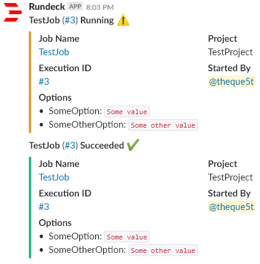

# rundeck-diy-webhook-notification

[Rundeck](https://www.rundeck.com/) [notification plugin](https://rundeck.org/docs/developer/notification-plugin.html) for the DIYer, because it allows you to supply your own custom messages to be sent to a webhook.

## Installation

1. Download the [plugin file](https://github.com/theque5t/rundeck-diy-webhook-notification/raw/master/build/libs/rundeck-diy-webhook-notification-1.0.0.jar)

```sh
wget "https://github.com/theque5t/rundeck-diy-webhook-notification/raw/master/build/libs/rundeck-diy-webhook-notification-1.0.0.jar"
```

2. Put the plugin file, rundeck-diy-webhook-notification-1.0.0.jar, into the [plugin directory](https://rundeck.org/docs/developer/plugin-development.html)

```sh
mv rundeck-diy-webhook-notification-1.0.0.jar /var/lib/rundeck/libext
```

3. The plugin is now ready for use

## Usage
### Provider Name: `DIYWebhookNotificationPlugin`
### Plugin Properties:
 - __Webhook URL:__ The webhook url. Example: `https://hostname/services/TXXXXXXXX/XXXXXXXXX/XXXXXXXXXXXXXXXXXXXXXXXX`  
 configure project: `project.plugin.Notification.DIYWebhookNotificationPlugin.webhookUrl=••••••••`  
 configure framework: `framework.plugin.Notification.DIYWebhookNotificationPlugin.webhookUrl=••••••••`  
  
 - __Content Type:__ The content type header. Example: `application/json`  
 configure project: `project.plugin.Notification.DIYWebhookNotificationPlugin.contentType=value`  
 configure framework: `framework.plugin.Notification.DIYWebhookNotificationPlugin.contentType=value`  
  
 - __Message Body:__ The message body. Example: `{"text":"Hello world!"}`  
 configure project: `project.plugin.Notification.DIYWebhookNotificationPlugin.messageBody=value`  
 configure framework: `framework.plugin.Notification.DIYWebhookNotificationPlugin.messageBody=value`  
 ___
### Building the Message
The execution order and summary of what occurs when building the final message body is as follows: 
 1. Any embedded property references will be replaced with the runtime value.
 2. Any execution data references will be replaced with the runtime value.
 3. Any template markup will be rendered.
___
### Embedded Property References
You can add [embedded property references](https://rundeck.org/docs/developer/notification-plugin.html) to your message following this syntax: `${group.key}`

Example for "On Start": 
```
{"text":"Job ${job.name}(#${job.execid}): Started"}
```
###### `${job.name}` and `${job.execid}` from the above example are embedded property references
___
### Execution Data References
You can add [execution data references](https://rundeck.org/docs/developer/notification-plugin.html) to your message following this syntax: `$map.key$`

Examples:
```
{"text":"Job ${job.name}(#${job.execid}): $execution.status$"}
```
###### `$execution.status$` from the above example is an execution data reference
```
{"text":"Job ${job.name}(#$execution.id$): $execution.status$"}
```
###### `$execution.id$` and `$execution.status$` from the above example are execution data references
```
{"text":"Job ${job.name}(#${job.execid}) from Group $execution.context.job.group$: $execution.status$"}
```
###### `$execution.context.job.group$` and `$execution.status$` from the above example are execution data references

[Refer here](https://rundeck.org/docs/developer/notification-plugin.html#execution-data) and [here](https://rundeck.org/docs/manual/creating-job-workflows.html#context-variables) to see what data is available.
You can also supply a reference that equals an entire map. For example:
```
{"text":"Job: ${job.name}
Id: $execution.job.id$
Status: $execution.status$
Job Details: $execution.job$"}
```
###### `$execution.job$` from the above example points to the job map

___
#### Template Markup
You can add template markup following [the template language](https://shopify.github.io/liquid/) syntax.

Example:
```
{"text":"Job ${job.name}(#${job.execid}): {{ "$execution.status$" | capitalize }}"}
```
###### `{{ "$execution.status$" | capitalize }}` from the above example is template markup


Refer to the [documentation for designers](https://github.com/Shopify/liquid/wiki/Liquid-for-Designers) for further assistance with the template language.
___
### Slack Example

__Webhook URL:__ `https://hooks.slack.com/services/TXXXXXXXX/XXXXXXXXX/XXXXXXXXXXXXXXXXXXXXXXXX` 

__Content Type:__ `application/json` 

__Message Body:__
```
{
        "username": "Rundeck",
        "icon_url": "https://github.com/theque5t/rundeck-diy-webhook-notification/raw/master/docs/images/rundeck.png",
        "channel": "#test",
        "attachments": [
          {
            "fallback":"*$execution.job.name$* (<$execution.href$|#$execution.id$>) {{ status | append: " :warning:" }}{{ status | append: " :heavy_check_mark:" }}{{ status | append: " :heavy_multiplication_x:" }}",
            "pretext":"*$execution.job.name$* (<$execution.href$|#$execution.id$>) {{ status | append: " :warning:" }}{{ status | append: " :heavy_check_mark:" }}{{ status | append: " :heavy_multiplication_x:" }}",
            "color":"warninggooddanger",
            "fields":[
          {
            "title":"Job Name",
            "value":"<$execution.job.href$|$execution.job.name$>",
            "short":true
          },
          {
            "title":"Project",
            "value":"$job.project$",
            "short":true
          },
          {
            "title":"Execution ID",
            "value":"<$execution.href$|#$execution.id$>",
            "short":true
          },
          {
            "title":"Started By",
            "value":"<@XX00XXX0X>{{ user }}",
            "short":true
          },
          {
            "title":"Options",
            "value":" •  {{ option | replace_first: '=', ': `' }}`\n",
            "short":true
          }
          
        ]
      }
    ]
}
```
__Linking to the Slack user:__ `"value":"<@XX00XXX0X>{{ user }}"` from the above example is template markup that replaces the Rundeck user value with the correlating Slack member ID. The Slack member ID can be found on their Slack profile. This shows how you can link the job notifications to the Rundeck user's Slack account.  
  

___
## Acknowledgements

rundeck-diy-webhook-notification makes use of the open source projects listed on the [index.html](build/reports/dependency-license/index.html) in the build/reports/dependency-license directory. [Click here](build/reports/dependency-license/index.html) to be automatically redirected to the index.html.